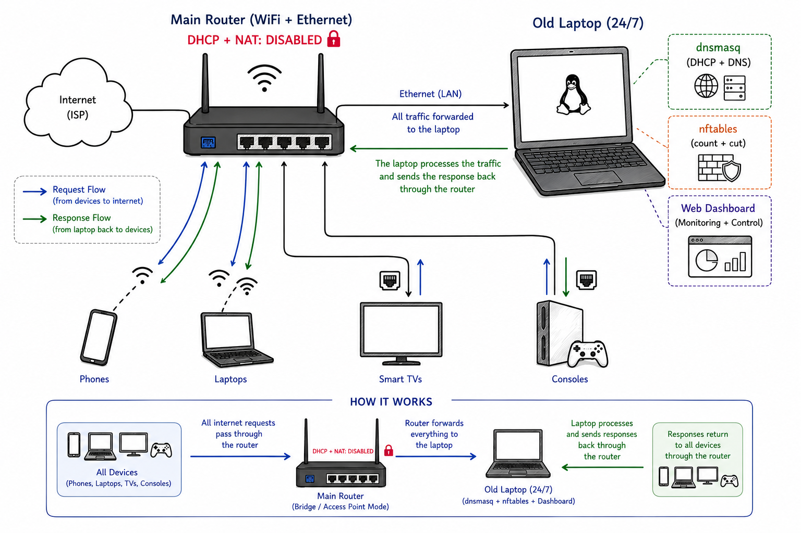

# Quota Manager

<a href="README_AR.md"></a> 

<table>
  <tr>
    <td width="300" align="center"></td>
    <td>

Split your metered internet bundle fairly across every person in the house. Each
**user** gets an allowance (fixed GB, or an equal share of what's left), their
devices all share it, and the moment the allowance runs out **every device they
own is cut at once**.

In countries where internet bundles are metered (e.g. Egypt's 140 GB/month plans),
phones, TVs, laptops and consoles all fight over one connection with no way to
budget it. **Quota Manager** turns an old laptop running 24/7 into a smart
gateway:

- Counts exactly what every device and every user consumes each month
- Gives each user a monthly allowance their devices share
- **Hard-cuts a user's internet** the moment they run out (a per-device *exempt*
  flag keeps one device online)
- Caps any device's or user's **internet speed** and keeps gaming ping low while
  others download
- Serves a **dark obsidian-glass dashboard** you can open from any phone on
  the LAN — the whole UI (dashboard, the household milestone page, and the
  consumption report) is phone-friendly and touch-first

    </td>
  </tr>
</table>

<p align="center">
  
</p>

**For developers** — how the app actually works (architecture, config, API,
tests, release process): [Structure_README.md](Structure_README.md).

## Screenshot


---

## Table of contents

- [Screenshot](#screenshot)
- [Installation](#installation)
- [Using the dashboard](#using-the-dashboard)
- [Strong (WAN) mode](#strong-wan-mode)
- [Securing the dashboard (HTTPS)](#securing-the-dashboard-https)
- [VPN share (route the household through a VPN)](#vpn-share-route-the-household-through-a-vpn)
- [Day to day](#day-to-day)
- [Upgrading / removing](#upgrading--removing)
- [Troubleshooting](#troubleshooting)
- [Known limits](#known-limits)

---

## Installation

You need a computer with **one wired Ethernet port**, powered 24/7, running
**Kali or Debian** — an old laptop, a used mini PC, or a Raspberry Pi all
work. It becomes the gateway that every device routes through.

### No spare machine? Use the PC or laptop you already have (wired only)

If you don't own a second computer, the gateway can run inside a **Debian
virtual machine** on the PC or laptop you already use. Three things matter:

- **A wired connection.** The machine must reach the router with an Ethernet
  cable (a cheap USB-to-Ethernet adapter works). **WiFi will not work** — the
  gateway must sit on the router's network at the hardware level, which a
  wireless link can't provide.
- **Bridged networking.** Set the VM's network adapter to *bridged* so it
  appears on the router's network like a real computer.
- **Always on.** The machine must stay running 24/7 — when it sleeps, shuts
  down, or restarts, everyone loses internet.
- **A fixed address — reserve it or set it static.** The gateway must keep a
  permanent IP on the router's network: either **reserve one on the router**
  (a DHCP reservation for the VM's MAC) or **set it static on the box** (the
  setup script does this by default). If the VM's IP ever changes, everyone
  loses access — see *The gateway's addresses (LAN mode)* below. In a VM,
  bridged networking puts the box on the router's LAN exactly like a real
  machine, so the same rule applies.

From there, follow the steps below as usual: the `.deb` installs *inside* the
VM, and the whole gateway (routing, network stack, dashboard) runs there. This
is also a great way to try Quota Manager before committing any hardware.

### 1. Install the package

#### Method A — apt repository (Debian / Kali)

**Easiest for bare-metal installs** (one-time key + repo setup, then upgrades via `apt update && apt upgrade`):

```bash
sudo install -d /etc/apt/keyrings
curl -fsSL https://UserJoo9.github.io/QuotaManager/quota-manager.gpg | \
  sudo gpg --dearmor -o /etc/apt/keyrings/quota-manager.gpg
echo "deb [signed-by=/etc/apt/keyrings/quota-manager.gpg] https://UserJoo9.github.io/QuotaManager stable main" | \
  sudo tee /etc/apt/sources.list.d/quota-manager.list
sudo apt-get update
sudo apt-get install quota-manager
```

The repository is signed with the key above and re-published automatically on
every release, so upgrades are just `sudo apt-get update && sudo apt-get
upgrade`.

---

#### Method B — Docker (any Linux machine / server)

Docker lets you run Quota Manager containerized on any Linux box. See
[DOCKER_DEPLOYMENT.md](DOCKER_DEPLOYMENT.md) for the full guide.

---

#### Method C — downloaded `.deb`

Download the latest `quota-manager_<version>_all.deb` from the
[Releases](https://github.com/UserJoo9/QuotaManager/releases) page, then:

```bash
sudo apt install ./quota-manager_0.2.1_all.deb
```

> **Fresh Kali/Debian box? Run `sudo apt-get update` first.** A brand-new
> install has never downloaded package lists, so apt reports *"no installation
> candidate"* for every dependency (`python3-venv`, `dnsmasq`, …) and aborts.
> On Kali a missing signing key shows up first as `NO_PUBKEY …` / *"repository
> … is not signed"* — fix with `sudo apt install --reinstall
> kali-archive-keyring`, then `sudo apt-get update`, then retry the install.
> (Full table in Troubleshooting.)

The package installs everything automatically: the Python app, the network
stack (dnsmasq, nftables), and a service that starts the gateway at boot.
Your device must be connected to the router by cable with internet during
this step.

### 2. Set your bundle

The dashboard asks for your bundle the first time you log in (step 4): a
one-time **welcome panel** appears with two required fields —

- **Internet bundle this month (GB)** — your real monthly allowance, e.g.
  `140` for a 140 GB/month plan
- **Reset day of the month** — the day your ISP resets the bundle (`0` = no
  auto-reset; you recharge from the dashboard instead)

plus a **bundle type** selector:

- **Renew day** (default) — the bundle resets on your configured reset day
- **End of month** — the ISP's *month-end bill*: the same configured day drives
  the reset (many ISPs close the month on the 25th/28th), and day `0` falls
  back to the calendar end (the 1st)

It also lets you change the admin password in the same step. All values can be
changed later in the dashboard's **Bundle settings** card.

### 3. Turn off the router's DHCP

Log into the router admin page (usually `http://192.168.1.1`), find the DHCP /
LAN settings, and switch DHCP **off**. Keep **WiFi** (same SSID and password)
and **NAT** on — devices still join the router's WiFi, but now get their IP,
gateway and DNS from the laptop. **Also disable IPv6 / Router Advertisement
(RA)** on the router (Quota Manager is IPv4 only).

> **Optional — electric-cut fallback.** If you'd rather devices keep the
> internet during a power cut, don't switch DHCP fully off — give the router a
> small pool on a *different* subnet (e.g. `192.168.1.201–250`). The laptop
> only serves `192.168.2.x`, so the pools never overlap. Devices return to the
> managed pool as their leases renew.

### 4. Log in

Reconnect every device to the WiFi (toggle airplane mode / reboot) so it gets a
new address from *your* DHCP, then open the dashboard from any device:

```
http://192.168.2.1:8080
```

Default password is **`admin`** — **change it immediately** (Admin tab).

> **Can't reach the dashboard?** A device still holding an old `192.168.1.x`
> lease can't reach `192.168.2.1`. Reconnect it so it re-leases, or open
> `http://192.168.1.110:8080` instead.

**Done.** New devices appear in the dashboard automatically the first time they
join — but as a safety lock they join **disabled**: a brand-new device's user
gets **0 GB and no share of the bundle**, so the device is cut off until you
open its user/device edit modal and assign **Shared** (auto) or **Fixed** GB.
Set each person's allowance from **Add user** and you're running.

### The gateway's fixed address (LAN mode)

The gateway box needs a **permanent IP** on the router's network. Either
**reserve one on the router** (a DHCP reservation for the machine's MAC) or
the setup script sets one by default (`192.168.1.110`). If the IP changes,
everyone loses internet.

The dashboard is at `http://192.168.2.1:8080` from client devices. If a device
still holds an old `192.168.1.x` lease, try `http://192.168.1.110:8080` instead.

### Running from source (developers)

See [Structure_README.md](Structure_README.md) → *Running from source*.

---

## Using the dashboard

| Tab | What it does |
|---|---|
| **Management** | the bundle ring (used / remaining / days left) and a card per **user** (features a Layout Toggle for Grid/Masonry/List views) — allowance, usage bar, block toggle, top-up, edit, delete — with their devices listed underneath (name, MAC, manufacturer, its own quota bar + up/down split). Each device card also shows **how it's connected** (WiFi / LAN chip) and a **presence LED** that goes grey when the device stops answering. A user can be flagged **Exempt from quota** (never quota-blocked, however much they use — manual blocks still work) |
| **Network** | bundle settings, **Guest mode** (auto-register new devices with a small allowance + speed limit + guest cap + **STOP NEW CONNECTIONS**), **Reset month now**, speed shaping master switch (set your real line rates), **VPN share**, **Decline random MACs**, **MAC whitelist / blacklist** (whitelisted MACs bypass quota blocks; blacklisted MACs are always blocked — the blacklist wins; **deleting a device or user blacklists its MACs permanently**), and a live network overview |
| **WAN** | optional "strong" mode where the laptop dials the PPPoE line itself (see below) |
| **Admin** | security & credentials (change the dashboard password, setup Two-Factor Authentication (2FA) with a QR code), **Software updates** (check for a newer release and install it from the dashboard), and **System Info & About** with **System Logs** (level filter, search, refresh, export) |
| **DNS** | domain filtering (block / allow / redirect a domain for a user, a device, or everyone; blocklist presets including Adult-content blocking; per-client DNS servers) |
| **History** | what each device is actually visiting: pick a device + a look-back window → its **top domains** (with share %), an **hourly activity** list, and the **most recent queries** (minute buckets) |
| **Firewall** | network-level access rules: a **default security posture** (LAN: open outward; WAN: block all new inbound), **custom rules** (add, edit, delete), **automatic bans** (brute-force, port scans), **port forwards** (add, edit, delete), **DMZ target**, and a **Firewall log**. Applies instantly with auto-revert on connectivity loss |

The sidebar footer's **eye** toggle masks on-screen sensitive details — MAC
addresses (device rows, rogue rows, the device modal) and the saved PPPoE
credentials (the username AND password fields are cleared while it is on and
re-prefilled from the DB when turned off) — so the dashboard can be shown
without giving away device identities. The preference is remembered; only the
display is masked, nothing is ever lost. A **bell** icon in the top-right
corner shows a red badge when there are new security alerts (failed logins,
WAF blocks, default-password warning); click it for a timestamped list with a
"Clear all" button.

**On a phone?** The whole UI is built for it. The tab bar becomes a swipeable
strip, the bundle ring shrinks and the cards stack to one column, and every
modal/overlay scrolls instead of clipping. The same applies to the household
milestone page and the consumption report — nothing needs a desktop.

**Speed limits per device/user** — set them in the Network tab first (switch ON
and enter your real down/up Mbps), then open a user's or device's **edit** modal
and set `limit down` / `limit up` (`0` = unlimited). Limits apply within seconds.
Speed caps apply to **internet traffic only** — LAN transfers pass through
at full speed.

**Decline random MACs** (Network tab) — while on, devices with randomized MACs
are refused at the DHCP level (dnsmasq never hands them an address).

**STOP NEW CONNECTIONS** (same section) — while on, dnsmasq refuses brand-new
devices outright. Already-registered devices and guests are unaffected.

**Exempt from quota** — a user's **edit** modal has an "Exempt from quota"
checkbox: an exempt user is never quota-blocked, however much they use. Handy
for the box's own VPN relay or an always-on server.

**Browsing history per device** — the **History** tab shows what domains each
device resolves (top domains, activity by the hour, recent queries). Retention
is **7 days by default** (a user's edit modal has a "History retention" field).

**Domain filtering** — the **DNS** tab blocks, allows or redirects domains
straight from the box's DNS. Pick a user or device, enter a domain (wildcards
work), and an action. Turn on a **blocklist preset** (ads-tracking,
social-media, streaming, gambling) and the box fetches the curated lists
itself. Rules apply within seconds. One honest limit: a client using
DNS-over-HTTPS/TLS bypasses it.

---

## Strong (WAN) mode

The default LAN setup has two ways a determined static-IP cheater can slip past
the box. **Strong (WAN) mode closes them** by having the gateway laptop dial
the PPPoE line itself — the router becomes a pure bridge/AP and every byte must
cross the box.

It's **off by default**. Turn it on only if you need the airtight boundary.

**Workflow — all from the WAN tab:**

1. Set your PPPoE credentials (from your ISP contract)
2. Click **Test PPPoE connection** to verify credentials work
3. Rewire the router to bridge/AP mode
4. Click **Apply now** — the box rewires itself and restarts

To leave WAN mode: put the router back in routed/NAT mode, then **Revert to LAN**.

**Heads up:** the physical router rewiring is always manual — no panel can move
the cable. If you apply WAN before the router is actually bridged, internet is
cut for everyone until it is.

The architecture behind this is in
[Structure_README.md](Structure_README.md) → *Strong (WAN) mode*.

---

## Securing the dashboard (HTTPS)

When you enable **Strong (WAN) mode**, the dashboard is reachable from the
internet — your admin password and data travel unencrypted. The dashboard shows
a warning about this.

To fix it, open the **Firewall tab** and click **Enable HTTPS** in the
**Enforce HTTPS** card. The box generates a self-signed TLS certificate, writes
it to disk, and restarts — the dashboard comes back over HTTPS within seconds.
Accept the browser's certificate warning once and the connection is encrypted.

To undo it, click **Remove HTTPS** (appears next to the active status), confirm
in the dialog, and the box reverts to plain HTTP.

> **LAN only?** This is entirely optional — your dashboard port is never
> exposed to the internet on a LAN-only setup.

---

## VPN share (route the household through a VPN)

If you run a VPN client on the gateway laptop (sing-box, xray, WireGuard, or
**v2rayN**), the Network tab's **VPN share** switch sends every device's
internet through that tunnel — the whole household appears at the VPN
provider's IP.

**What stays working:** per-device quota counting, hard blocks, and speed
shaping are untouched. The box's own DNS/DHCP still serve the LAN, and direct
LAN traffic (routers, NAS) never enters the tunnel.

**v2rayN users:** the box auto-downloads and bridges v2rayN's SOCKS listener
via `tun2socks` — just flip the switch, nothing to install by hand. A real
kernel tunnel (xray/sing-box/WireGuard) is always preferred.

**To use it:** start the VPN client first (in TUN mode), then flip the
**VPN share** switch in the Network tab. The switch works either way — the
rule only lands once the tunnel actually exists.

**Switching VPN servers or clients:** the tunnel is re-detected
automatically — when the new connection appears alongside the old one, the
household moves to the newest tunnel within one 15 s tick (the box and the
devices always exit at the same VPN IP). If devices ever seem stuck on an old
server, toggle **VPN share** off and back on — that clears the remembered
tunnel and forces a fresh detection.

The design is in
[Structure_README.md](Structure_README.md) → *VPN share*.

---

## Day to day

Open the dashboard and check the **bundle ring** — are you on pace for the
month? Scan the user cards for **Quota exceeded** tags and decide whether to top
up or leave them cut off. Name any new "Unnamed" device (its manufacturer tag
helps tell phones from TVs). That's the whole loop.

**To top up a user mid-month:** user card → *top-up* → enter GB. They're
unblocked instantly if they were cut.

**"How much do I have left?" — the household page.** Any device on the quota
network can open `http://<gateway-ip>:8080/milestone` (no login). It shows that
device's user: their used / allowance, a progress bar, and a **per-device
breakdown** (each device's own GB, with ↑/↓ split). Crossing 50% / 75% / 100%
is flagged once per month on the page (a "new" pill), and acknowledging it is
a one-time click — the flag won't nag again until the period rolls.

---

## Software updates

The Admin tab's **Software updates** card checks the GitHub releases page for
the box (by default every 24 h; disable with the "Check automatically" toggle
or `updates.enabled: false` in `config.yaml`). When a newer version exists a
banner appears across the top of the dashboard — click **Show details** for a
scrollable list of every new version's changelog (a box that's far behind lists
all the intermediate versions). The banner shows once per version.

From the same card you can check now (Check for updates), and **install the
update from the dashboard** — the box downloads the `.deb` and runs the
install behind the scenes (it stays online throughout; the gateway service
restarts once as part of the upgrade, so internet drops for a few seconds).
"Auto-install" does the same automatically whenever a check finds a newer
version. Your config and database are preserved on upgrade (see below).

> The check needs the box to reach `api.github.com`. If it shows "Couldn't
> reach GitHub" (e.g. a timeout), it retries automatically at the next
> interval — verify the box has internet (WAN tab) first.

---

## Upgrading / removing

```bash
# Upgrade (apt repository): your config + database survive
sudo apt-get update
sudo apt-get install --only-upgrade quota-manager

# ...or download the new .deb and install it (no repository)
# sudo apt install ./quota-manager_<new-version>_all.deb

# Remove (keeps config + database)
sudo apt remove quota-manager

# Remove entirely (also deletes /opt/quota-manager)
sudo purge quota-manager
```

For Docker: `docker compose pull && docker compose up -d` to upgrade,
`docker compose down` to stop. See [DOCKER_DEPLOYMENT.md](DOCKER_DEPLOYMENT.md).

**Back up** your database occasionally (while the service is stopped) — it
holds every device, allowance, and history: `/var/lib/quota-gateway/quota.db`

---

## Troubleshooting

| Symptom | Likely cause | Fix |
|---|---|---|
| Devices have no internet after setup | Router DHCP still on, or wrong client IP | Disable router DHCP; reconnect devices; reboot |
| "nftables engine unavailable" in the log | `nft` missing or not run as root | Install nftables; the service runs as root |
| Devices get DHCP but aren't counted | their gateway isn't the laptop, or the NAT is missing | Check a device's gateway is `192.168.2.1` |
| Devices use the internet but aren't counted | client IPv6 bypasses the gateway (router hands out RA) | Disable IPv6/RA on the router — Quota Manager is IPv4 only |
| No internet after applying WAN mode | `ppp0` down — wrong credentials, or router not bridged/AP yet | WAN tab: check the ppp0 state; press **Apply now** again |
| Forgot the admin password | — | Stop the app, delete the `admin_password` setting from the DB, restart |
| Dashboard only reachable from the laptop | `web.host` is `127.0.0.1` | Set `web.host: 0.0.0.0` |
| Software updates card says "Couldn't reach GitHub" | the box can't reach `api.github.com` | Verify the WAN/internet dot; check retries automatically next interval |
| Speed limits don't apply | Network tab never configured (switch off or rates still 0) | Network tab → toggle ON → set your real down/up Mbps → Save |
| Internet died after a reboot | gateway service not enabled | `sudo systemctl enable --now quota-gateway` |

---

## Known limits

- **Counting is approximate** (the dashboard shows "≈") — counters are read
  every ~15 s, so the live split lags slightly.
- **Hard blocks, not throttles.** Exceeded users are cut off (kernel drop);
  speed *caps* exist separately in the Network tab.
- **IPv4 only.** If your router/ISP is dual-stack, WiFi clients may take IPv6
  straight from the router — disable IPv6/RA on the router.
- **Single point of failure.** A power cut to the laptop takes down the managed
  network unless the electric-cut fallback pool is set (see Installation step 3).
- **Deleting a device or user is permanent** until you say otherwise. The device
  is blacklisted and stays kernel-blocked even while connected — remove its MAC
  from the deny list to let it back in.
- **Update checks need the box to reach GitHub.** A box without internet shows
  "Couldn't reach GitHub" and retries at the next interval. The check never
  affects internet, DNS or quota for devices.
- **The household milestone page (`/milestone`) is public** — no login, by
  design. It only shows the requesting device's own user.

---

## License

[MIT](LICENSE) — free to use, modify, and distribute, with attribution.
Not affiliated with any ISP.
