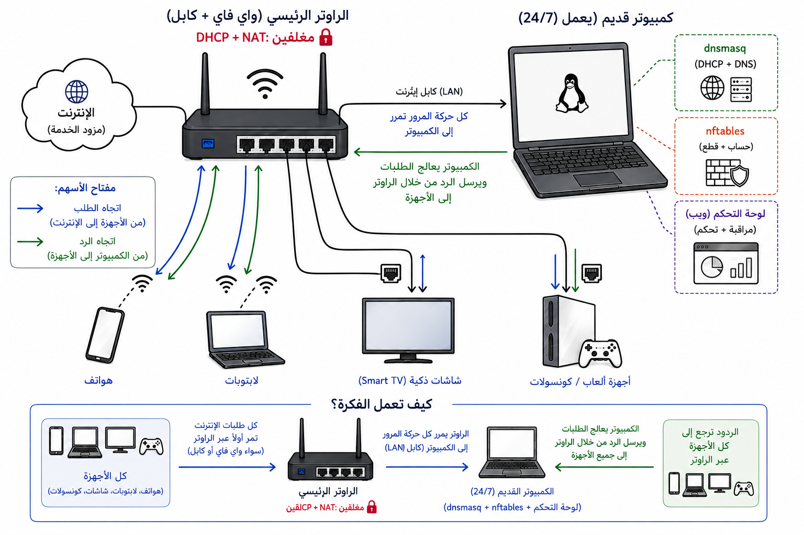
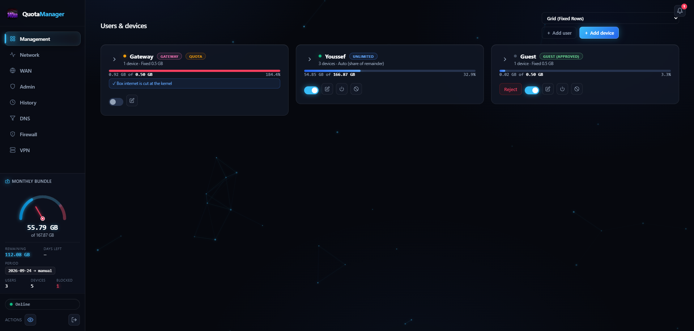

<h1 align="center">
  &nbsp;Quota Manager
</h1>

<p align="center">
  <a href="README.md"></a>
  
</p>


وزّع حزمة الإنترنت المحدودة بشكل عادل بين كل شخص في المنزل. يحصل كل **مستخدم**
على حصة (بجيجابايت ثابت، أو حصة متساوية من المتبقي)، وتتقاسمها أجهزته كلها
معًا، وبمجرد نفاد الحصة **يُفصل كل جهاز يملكه في نفس اللحظة**.

في البلدان التي تُحاسَب فيها حزم الإنترنت (مثل خطط مصر 140 جيجابايت/شهر)،
تتصارع الهواتف والتلفزيونات واللابتوبات وأجهزة الألعاب على اتصال واحد دون أي
وسيلة لإدارته. يحوّل **Quota Manager** لابتوبًا قديمًا يعمل 24/7 إلى بوابة
ذكية:

- يُحسب بدقة ما يستهلكه كل جهاز وكل مستخدم شهريًا
- يمنح كل مستخدم حصة شهرية تتقاسمها أجهزته
- **يقطع إنترنت المستخدم تمامًا** لحظة نفاد حصته (علامة *إعفاء* لكل جهاز
  تُبقي جهازًا واحدًا متصلًا)
- يحدّد **سرعة الإنترنت** لأي جهاز أو مستخدم ويُبقي البينج في الألعاب منخفضًا
  بينما يحمّل آخرون
- **عداد السرعة التفاعلي للباقة (Speedometer Gauge)**: عداد أنيق عالي الدقة لعرض استهلاك
  الباقة الشهرية بنطاق أمان هادئ (0–80%) ونطاق تحذير أحمر متوهج (80–100%)، مع 3 تصميمات
  فيزيائية متميزة يمكن التبديل بينها في الإعدادات (**المؤشر الرياضي**، **شاشات LED المقطعة**،
  و**قوس الأفق الكهربائي**)
- **محرك السمات والمؤثرات البصرية (Themes & Particle FX)**: إمكانية الاختيار بين 4 سمات
  لونية للواجهة (Obsidian Glass وCyberpunk وEmerald وSunset) مع 4 مؤثرات متحركة تفاعلية للخلفية
- **فصل فوري مؤقت للأجهزة (Kick لمدة 5 ثوانٍ)**: طرد أو فصل أي جهاز فورياً لإجباره على
  تجديد الاتصال وتفريغ حزم البيانات دون حظره أو إضافته للقائمة السوداء
- **نظام VPN مدمج متقدم (محرك sing-box وClash API)**: استيراد روابط VLESS وVMess
  وShadowsocks وTrojan وWireGuard، مع عدادات سرعة حية، ومحرر تفاعلي لإعدادات البروكسي،
  وتوجيه مخصص لكل جهاز ومستخدم بشكل مستقل، مع استئناف الاتصال تلقائيًا بعد إعادة التشغيل أو تحديث الصفحة
- **درع مانع الإعلانات العتادي وتصفية المحتوى (DNS)**: حظر الإعلانات والتتبع
  على مستوى الشبكة بالكامل (HaGeZi PRO + AdGuard + StevenBlack) دون تثبيت أي برامج
  على الأجهزة، مع فلاتر رقابة أبوية فورية لمواقع البالغين والقمار وشبكات التواصل
- **إشعارات Telegram عند تغيّر الـ Public IP**: إرسال تنبيه فوري عبر بوت تلجرام
  مع رابط مباشر للوحة التحكم فور تغيّر الـ IP لتسهيل الإدارة والتحكم في الشبكة من خارج المنزل في أي وقت
- **تحليلات سجل التصفح والنشاط**: رسوم بيانية توضح أكثر التطبيقات والمواقع زيارة
  (مثل يوتيوب، تيك توك، نتفليكس، فيسبوك) مع سجل زمني لنشاط كل جهاز على مدار اليوم
- **حجز عناوين IP ثابتة (Static DHCP)**: تثبيت عناوين الـ IP للأجهزة والطابعات
  وسيرفرات المنزل بنقرة واحدة مباشرة من لوحة التحكم
- يوفّر **لوحة تحكم داكنة بلمسة زجاجية (obsidian-glass)** مع تنقل فوري وسلس بين
  التبويبات بدون أي وميض تحميل، مصممة بالكامل لتعمل بسلاسة على شاشات الهواتف واللمس أولاً

<p align="center">
  
</p>

**للمطورين** — كيف يعمل التطبيق فعليًا (البنية، الإعدادات، الـ API، الاختبارات،
عملية الإصدار): [Structure_README.md](Structure_README.md).

## لقطة الشاشة



---

## جدول المحتويات

- [لقطة الشاشة](#لقطة-الشاشة)
- [التثبيت](#التثبيت)
- [استخدام لوحة التحكم](#استخدام-لوحة-التحكم)
- [الوضع القوي (WAN) وإشعارات Telegram](#الوضع-القوي-wan-وإشعارات-telegram)
- [نظام VPN المدمج (sing-box)](#نظام-vpn-المدمج-sing-box)
- [درع مانع الإعلانات وتصفية DNS](#درع-مانع-الإعلانات-وتصفية-dns)
- [تأمين لوحة التحكم (HTTPS)](#تأمين-لوحة-التحكم-https)
- [التعامل اليومي](#التعامل-اليومي)
- [الترقية / الإزالة](#الترقية-الإزالة)
- [استكشاف الأخطاء وإصلاحها](#استكشاف-الأخطاء-وإصلاحها)
- [القيود المعروفة](#القيود-المعروفة)

---

## التثبيت

تحتاج إلى كمبيوتر به **منفذ إيثرنت سلكي واحد**، يعمل 24/7، بنظام **Kali أو
Debian** — لابتوب قديم، أو كمبيوتر صغير مستعمل، أو Raspberry Pi كلها تعمل.
يصبح البوابة التي يمر عبرها كل جهاز.

### لا تملك جهازًا إضافيًا؟ استخدم الكمبيوتر أو اللابتوب الذي تملكه بالفعل (سلكي فقط)

إذا لم تملك كمبيوترًا ثانيًا، يمكن للبوابة أن تعمل داخل **آلة افتراضية بنظام
Debian** على الكمبيوتر أو اللابتوب الذي تستخدمه بالفعل. ثلاثة أمور مهمة:

- **اتصال سلكي.** يجب أن تصل الآلة إلى الراوتر بكابل إيثرنت (محول USB-to-Ethernet
  رخيص يعمل). **WiFi لن يعمل** — يجب أن تقع البوابة على شبكة الراوتر على مستوى
  العتاد، وهو ما لا يوفره اتصال لاسلكي.
- **شبكة موصولة (Bridged).** اضبط محول الشبكة في الآلة الافتراضية على وضع
  *bridged* لتظهر على شبكة الراوتر مثل كمبيوتر حقيقي.
- **يعمل دائمًا.** يجب أن تظل الآلة تعمل 24/7 — عند نومها أو إيقاف تشغيلها أو
  إعادة تشغيلها، يفقد الجميع الإنترنت.
- **عنوان ثابت — احجزه أو اضبطه ثابتًا (static).** يجب أن تحتفظ البوابة بعنوان
  IP دائم على شبكة الراوتر: إما **احجز واحدًا على الراوتر** (حجز DHCP لعنوان
  MAC للآلة الافتراضية) أو **اضبطه ثابتًا على الجهاز** (سكربت الإعداد يفعل ذلك
  افتراضيًا). إذا تغير عنوان IP للآلة الافتراضية يومًا، يفقد الجميع الوصول —
  انظر *عناوين البوابة (وضع LAN)* أدناه. في الآلة الافتراضية، تضع الشبكة
  الموصولة الجهاز على شبكة الراوتر المحلية تمامًا مثل جهاز حقيقي، فتنطبق
  القاعدة نفسها.

من هنا، اتبع الخطوات أدناه كالمعتاد: يُثبَّت ملف `.deb` *داخل* الآلة الافتراضية،
وتعمل البوابة كلها (التوجيه، حزمة الشبكة، لوحة التحكم) هناك. هذه أيضًا طريقة
رائعة لتجربة Quota Manager قبل الالتزام بأي عتاد.

### 1. ثبّت الحزمة

**الأسهل — التثبيت من مستودع apt** (إعداد مفتاح + مستودع مرة واحدة، ثم
الترقيات عبر `apt update && apt upgrade`):

```bash
sudo install -d /etc/apt/keyrings
curl -fsSL https://UserJoo9.github.io/QuotaManager/quota-manager.gpg | \
  sudo gpg --dearmor -o /etc/apt/keyrings/quota-manager.gpg
echo "deb [signed-by=/etc/apt/keyrings/quota-manager.gpg] https://UserJoo9.github.io/QuotaManager stable main" | \
  sudo tee /etc/apt/sources.list.d/quota-manager.list
sudo apt-get update
sudo apt-get install quota-manager
```

المستودع موقّع بالمفتاح أعلاه ويُعاد نشره تلقائيًا مع كل إصدار، لذا الترقيات
مجرد `sudo apt-get update && sudo apt-get upgrade`.

**بديل — تثبيت ملف `.deb` مُحمَّل.** حمّل أحدث `quota-manager_<version>_all.deb`
من صفحة [الإصدارات](https://github.com/UserJoo9/QuotaManager/releases)، ثم:

```bash
sudo apt install ./quota-manager_0.2.1_all.deb
```

> **جهاز Kali/Debian جديد؟ شغّل `sudo apt-get update` أولًا.** التثبيت الجديد
> تمامًا لم يسبق له تنزيل قوائم الحزم، لذلك يُبلّغ apt عن *"no installation
> candidate"* لكل اعتماد (`python3-venv`، `dnsmasq`، …) ويُجهض. على Kali يظهر
> المفتاح المفقود أولًا كـ `NO_PUBKEY …` / *"repository … is not signed"* —
> أصلحه بـ `sudo apt install --reinstall kali-archive-keyring`، ثم
> `sudo apt-get update`، ثم أعد محاولة التثبيت. (الجدول الكامل في استكشاف
> الأخطاء وإصلاحها.)

يُثبّت الحزمة كل شيء تلقائيًا: تطبيق بايثون، وحزمة الشبكة (dnsmasq، nftables)،
وخدمة تُشغّل البوابة عند الإقلاع. يجب أن يكون جهازك متصلًا بالراوتر بالكابل
ومعه إنترنت أثناء هذه الخطوة.

### 2. اضبط حزمتك

تسأل لوحة التحكم عن حزمتك في أول تسجيل دخول (الخطوة 4): تظهر **لوحة ترحيب**
لمرة واحدة بحقلين مطلوبين —

- **حزمة الإنترنت لهذا الشهر (جيجابايت)** — حصتك الشهرية الحقيقية، مثل
  `140` لخطة 140 جيجابايت/شهر
- **يوم تجديد الشهر** — اليوم الذي يجدد فيه مزود الخدمة الحزمة (`0` = لا
  تجديد تلقائي؛ تشحن من لوحة التحكم بدلًا من ذلك)

كما يتيح لك تغيير كلمة مرور المشرف في نفس الخطوة. يمكن تغيير القيمتين لاحقًا
من بطاقة **إعدادات الحزمة** في لوحة التحكم.

تفضّل تعديل الإعدادات بدلًا من ذلك؟ الرقمان نفسيهما موجودان تحت `bundle` في
`/etc/quota-gateway/config.yaml` (إضافةً إلى `timezone` اختياري، لا تسأل عنه
لوحة الترحيب). عدّل وأعد التشغيل:

```bash
sudo nano /etc/quota-gateway/config.yaml
```

```yaml
bundle:
  total_gb: 140.0        # حزمتك الشهرية الحقيقية، جيجابايت
  reset_day: 1           # يوم من الشهر يجدد فيه مزود الخدمة الحزمة؛ 0 = لا تجديد تلقائي
  period_type: renew_day # renew_day (تجديد يوم محدد) | end_of_month (فاتورة نهاية الشهر)
timezone: ""             # منطقة زمنية IANA اختيارية، مثل Africa/Cairo
```

```bash
sudo systemctl restart quota-gateway
```

> **ملاحظة:** بمجرد ضبط الحزمة من لوحة التحكم، تصبح لوحة التحكم هي المالكة
> للقيمة — يُتجاهَل أي تعديل لاحق على config.yaml حتى تمسح إعداد `bundle_source`
> (انظر استكشاف الأخطاء وإصلاحها).

### 3. أطفئ DHCP للراوتر

ادخل إلى صفحة إدارة الراوتر (عادةً `http://192.168.1.1`)، وابحث عن إعدادات
DHCP / LAN، وأطفئ DHCP. أبقِ **WiFi** (بنفس اسم الشبكة وكلمة المرور) و **NAT**
مفعّلين — ما زالت الأجهزة تتصل بـ WiFi للراوتر، لكنها الآن تحصل على عنوان IP
والبوابة وDNS من اللابتوب. **عطّل أيضًا IPv6 / إعلانات الراوتر (RA)** على
الراوتر (Quota Manager يعمل بـ IPv4 فقط).

> **اختياري — بديل انقطاع الكهرباء.** إذا كنت تفضل بقاء الأجهزة على الإنترنت
> أثناء انقطاع الكهرباء، لا تطفئ DHCP تمامًا — أعطِ الراوتر نطاقًا صغيرًا على
> شبكة فرعية *مختلفة* (مثل `192.168.1.201–250`). يخدم اللابتوب فقط عناوين
> `192.168.2.x`، فلا تتداخل النطاقات أبدًا. تعود الأجهزة إلى النطاق المُدار
> مع تجدد عقودها.

### 4. سجّل الدخول

أعد توصيل كل جهاز بـ WiFi (بدّل وضع الطائرة / أعد التشغيل) ليحصل على عنوان
جديد من *خادم* DHCP الخاص بك، ثم افتح لوحة التحكم من أي جهاز:

```
http://192.168.2.1:8080
```

كلمة المرور الافتراضية هي **`admin`** — **غيّرها فورًا** (تبويب المشرف).

> **لا يمكنك الوصول إلى لوحة التحكم؟** الجهاز الذي ما زال يحمل عقدًا قديمًا من
> `192.168.1.x` لا يمكنه الوصول إلى `192.168.2.1`. أعد توصيله ليجدد العقد، أو
> افتح `http://192.168.1.110:8080` بدلًا من ذلك.

**تم.** تظهر الأجهزة الجديدة في لوحة التحكم تلقائيًا في أول اتصال لها — لكنها
تنضم **مُعطّلة** كقفل أمان: يحصل الجهاز الجديد على **0 جيجابايت ولا نصيب من
الحزمة**، فيبقى مقطوعًا حتى تفتح تعديل المستخدم/الجهاز وتمنحه **مشترك (تلقائي)**
أو **ثابت** جيجابايت. اضبط حصة كل شخص من **إضافة مستخدم** وستكون جاهزًا.

### عناوين البوابة (وضع LAN)

> **يجب أن يكون للجهاز عنوان ثابت — لا تتخطَّ هذا.** في وضع LAN تحتاج بوابة
> الجهاز إلى عنوان IP دائم على شبكة الراوتر. إما **احجز عنوانًا على الراوتر**
> (حجز DHCP لعنوان MAC للجهاز) أو **اضبطه ثابتًا على الجهاز نفسه** (سكربت
> الإعداد يفعل ذلك تلقائيًا، افتراضيًا `192.168.1.110`). إذا أمكن أن يتغير
> عنوان IP للجهاز — انتهاء عقد، أو إعادة تشغيل الجهاز، أو منح الراوتر العنوان
> لجهاز آخر — **يفقد الجميع الوصول**: تفقد الأجهزة بوابتها وDNS وتصبح لوحة
> التحكم غير قابلة للوصول.

تعمل بوابة الجهاز على **عنوانين ثابتين**:

- **الوصلة الصاعدة (Uplink)** — على الشبكة الفرعية للراوتر، باتجاه الراوتر
  (افتراضيًا `192.168.1.110/24`).
- **الشبكة الفرعية للعملاء** — الشبكة التي يخدمها (`192.168.2.1/24`). تحصل
  الأجهزة على عنوان `192.168.2.x` من DHCP للجهاز، و**البوابة + DNS لهذه
  الأجهزة هو الجهاز نفسه**.

بأي طريقة تثبّت عنوان الجهاز، تأكد أنه عنوان لن يمنحه نطاق DHCP للراوتر لجهاز
آخر (احجزه/استبعده على الراوتر، أو اختر عنوانًا خارج النطاق). إذا انزلق عنوان
uplink للجهاز أو تعارض، تفقد الأجهزة بوابتها وDNS.

تعيش لوحة التحكم على العنوانين معًا: `http://192.168.2.1:8080` من أجهزة
العملاء، أو `http://192.168.1.110:8080` من شبكة الوصلة الصاعدة (مفيد عندما
يحمل جهاز عقدًا قديمًا من `192.168.1.x`).

### التشغيل من المصدر (للمطورين)

انظر [Structure_README.md](Structure_README.md) ← *التشغيل من المصدر*.

---

## تشغيل البوابة 24/7 بأقل استهلاك كهرباء (هواتف أندرويد وراوترات OpenWrt)

تشغيل كمبيوتر مكتبي (PC) عادي طوال الـ 24 ساعة يستهلك ما بين 50 إلى 100 وات، مما يرفع فاتورة الكهرباء الشهرية بنقل العداد لشريحة أعلى. ونظراً لأن QuotaManager يعتمد كلياً على كيرنل لينكس الأصلي السريع (`nftables`, `tc`, `dnsmasq`)، يمكن تشغيله بكفاءة كاملة على **أجهزة موفرة جداً تستهلك 2 إلى 5 وات فقط** (تكلفة كهرباء شبه معدومة):

### الخيار الأول: هاتف أندرويد قديم مروّت (Root + OTG Ethernet)
أي هاتف أندرويد قديم مركون (أندرويد 7 حتى 14 بصلاحيات الروت Magisk أو KernelSU) يمكن تحويله إلى خادم بوابة صامت لا يستهلك أكثر من 3 وات:

1. **التوصيل والعتاد**:
   - وصّل بالهاتف وصلة **OTG Hub** تحتوي على منفذ **Ethernet (شبكة)** ومنفذ **شحن مستمر (Pass-through Charging)**.
   - وصّل كابل الإيثرنت بمنفذ LAN في راوتر الإنترنت الرئيسي.
   - *(نصيحة هامة)* لحماية بطارية الهاتف من الانتفاخ مع استمرار الشحن 24/7، استخدم تطبيق روت مثل **ACC (Advanced Charging Controller)** لتحديد سقف الشحن عند 60%–70%، أو انزع البطارية واستخدم توصيل 5V مباشر.

2. **البيئة البرمجية (Debian Chroot عبر Termux)**:
   - افتح تطبيق **Termux** واطلب صلاحيات الروت:
     ```bash
     su
     ```
   - ثبّت بيئة دبيان Debian 12 (ARM64) مدمجة عبر Chroot (باستخدام أدوات مثل `LinuxDeploy` أو سكربت Chroot).
   - داخل بيئة دبيان، ثبّت حزمة QuotaManager مباشرة من مستودع APT الرسمي:
     ```bash
     curl -fsSL https://UserJoo9.github.io/QuotaManager/KEY.gpg | gpg --dearmor -o /etc/apt/trusted.gpg.d/quota-manager.gpg
     echo "deb https://UserJoo9.github.io/QuotaManager/ stable main" > /etc/apt/sources.list.d/quota-manager.list
     apt-get update
     apt-get install -y quota-manager
     ```
   - افتح `http://192.168.2.1:8080` (أو عنوان IP الهاتف) وستعمل لوحة التحكم بكامل كفاءتها!

### الخيار الثاني: راوتر OpenWrt
إذا كان لديك راوتر مثبت عليه نظام **OpenWrt** (إصدار 22.03 أو أحدث):

1. **المتطلبات الأساسية**:
   - راوتر يحتوي على ذاكرة كافية (128MB+ RAM وفلاش؛ وللراوترات ذات الفلاش الصغير 16MB/32MB، فعّل خاصية **ExtRoot** باستخدام فلاشة USB رخيصة).
   - تثبيت الحزم المطلوبة عبر `opkg`:
     ```bash
     opkg update
     opkg install python3 python3-pip nftables kmod-nft-core ip-full dnsmasq-full
     ```

2. **تنزيل البرنامج وإعداده**:
   ```bash
   git clone https://github.com/UserJoo9/QuotaManager.git /opt/QuotaManager
   cd /opt/QuotaManager
   pip install -r requirements-linux.txt
   ```

3. **التشغيل التلقائي عبر Procd**:
   فعّل الخدمة لتبدأ تلقائياً مع تشغيل الراوتر باستخدام السكربت المرفق:
   ```bash
   cp /opt/QuotaManager/scripts/quota-manager.openwrt /etc/init.d/quota-manager
   chmod +x /etc/init.d/quota-manager
   /etc/init.d/quota-manager enable
   /etc/init.d/quota-manager start
   ```

---

## استخدام لوحة التحكم

| التبويب | ما يفعله |
|---|---|
| **الإدارة** | **عداد سرعة الباقة (Speedometer Gauge)** (عداد ديناميكي مع نطاق أمان وخط خطر أحمر و3 تصميمات فيزيائية متميزة) + إحصائيات منظمة في 3 صفوف (المتبقي، الأيام المتبقية، بادج تاريخ الفترة، وعدادات المستخدمين والأجهزة والمحظورين)، **تثبيت البوابة المحمية** في أعلى القائمة، وبطاقة لكل **مستخدم** (عرض شبكي/قائمة/بطاقات، حدود السرعة، الحصص، مفتاح الحظر، **زر الطرد/الفصل المؤقت 5 ثوانٍ**، وتفاصيل الاستهلاك). يمكن وضع علامة **معفى من الحصة** على المستخدمين |
| **الشبكة** | إعدادات الحزمة، **وضع الضيف** (تسجيل تلقائي + حد سرعة + حد ضيوف + **إيقاف الاتصالات الجديدة**)، **إعادة ضبط الشهر**، مفتاح ضبط السرعة (اختر معدلاتك الحقيقية)، **حجز عناوين DHCP الثابتة (Static Leases)**، **رفض MAC عشوائية**، **قائمة MAC بيضاء/سوداء**، ونظرة عامة مباشرة |
| **VPN** | **مدير VPN مدمج بنواة sing-box**: استيراد روابط VLESS وVMess وShadowsocks وTrojan وWireGuard عبر الروابط أو الـ QR، قياس سرعة الاستجابة (Ping)، محرر تفاعلي لإعدادات البروكسي والنقل (TCP/WS/gRPC) والشهادات (TLS/Reality)، عدادات سرعة حية عبر Clash API، وتوجيه أو استثناء مخصص لكل جهاز ومستخدم |
| **WAN** | طلب خط PPPoE مباشرة (الوضع "القوي") مع جدولة التجديد التلقائي لـ IP و**مُطلق إشعارات Telegram** فور تغيّر الـ Public IP |
| **DNS** | **درع مانع الإعلانات العتادي** (HaGeZi PRO + AdGuard + StevenBlack على مستوى الشبكة مع مفتاح تشغيل رئيسي)، **فلاتر المحتوى والرقابة الأبوية** (حظر المواقع الإباحية، القمار، التواصل الاجتماعي، منصات البث)، قواعد النطاقات المخصصة، واستيراد قوائم الحظر |
| **السجل** | تحليل استعلامات DNS ونشاط التصفح في الوقت الفعلي: اختر جهازًا + نافذة زمنية → **أهم النطاقات المستهلكة**، **نشاط بالساعة**، و**أحدث الاستعلامات** |
| **جدار الحماية** | قواعد أمان الشبكة: الوضع الافتراضي للشبكة، قواعد مخصصة، حظر هجمات التخمين وفحص المنافذ تلقائيًا، توجيه المنافذ (Port Forwarding)، تعيين جهاز DMZ، وسجل جدار الحماية المباشر |
| **المشرف** | **المظهر والسمات (Themes)** (4 سمات: الأساسي، سايبربانك، زمردي، غروب؛ 4 أنماط للمؤثرات الجزيئية في الخلفية؛ 3 تصميمات فيزيائية للعداد)، الأمان والمصادقة الثنائية (2FA)، **تحديثات البرنامج الذاتية**، و**سجلات النظام** داخل نافذة مخصصة قابلة للتمرير (فلتر، بحث، تصدير) |

مفتاح **العين** في تذييل الشريط الجانبي يخفي التفاصيل الحساسة على الشاشة —
عناوين MAC (صفوف الأجهزة، صفوف الأجهزة المارقة، نافذة الجهاز) وبيانات PPPoE
المحفوظة (يُمسح حقلا اسم المستخدم وكلمة المرور أثناء تشغيله ويُعاد تعبئتهما من
قاعدة البيانات عند إيقافه) — فيمكن عرض لوحة التحكم دون كشف هويات الأجهزة.
التفضيل محفوظ؛ فقط العرض يُخفى، ولا يُفقد شيء أبدًا.

**على الهاتف؟** واجهة المستخدم كلها مبنية له. شريط التبويبات يصبح شريطًا
قابلًا للتمرير باللمس، حلقة الحزمة تصغر وتتراص البطاقات في عمود واحد، وكل
نافذة منبثقة/طبقة قابلة للتمرير بدل الاقتطاع. الأمر نفسه ينطبق على صفحة مراحل
المنزل وتقرير الاستهلاك — لا شيء يحتاج حاسوبًا مكتبيًا.

**حدود السرعة لكل جهاز/مستخدم** — اضبطها في تبويب الشبكة أولًا (شغّل المفتاح
وأدخل معدلات التحميل/الرفع الحقيقية)، ثم افتح نافذة **تعديل** مستخدم أو جهاز
واضبط `limit down` / `limit up` (`0` = غير محدود). تُطبَّق الحدود خلال ثوانٍ.
**حد سرعة الضيف** الافتراضي (تبويب الشبكة ← وضع الضيف) يحد من إجمالي عرض
النطاق لكل حسابات الضيوف بنفس الطريقة — اضبط `0` (الافتراضي) لترك الضيوف غير
محدودين.

**حدود السرعة تُشكّل الإنترنت لا شبكتك المحلية** — الحدود أعلاه تخص حركة **WAN**
فقط. قسم السرعة في تبويب الشبكة مقسوم إلى اثنين: **WAN — الإنترنت** (معدلات
التحميل/الرفع الحقيقية) و**LAN — التحويلات الداخلية** (`set-lan-rate`، معدل
مرور الشبكة المحلية، `0` = الافتراضي 1000 ميجابت/ثانية). حركة العميل↔الشبكة
الفرعية الصاعدة (الـ NAS، صفحة إدارة الراوتر، تحويلات الشبكة المحلية) لا
يُخنقها معدل الخط أبدًا: تمر في فئة مرور مخصصة بمعدل **وصلة الشبكة المحلية
الكامل** بينما يبقى حد WAN وطوابير زمن الاستجابة المنخفض وحسابات
"min(device, user)" دون تغيير بايتًا ببايت. تعديل معدل الشبكة المحلية يُطبَّق
فورًا ويصمد أمام إعادة التشغيل (إنه إعداد لوحة تحكم، لا ملف إعدادات).

**رفض عناوين MAC العشوائية** (تبويب الشبكة ← الاتصال والأمان) — الهواتف
واللابتوبات التي تبدّل MAC الخاص بها للخصوصية لا تحمل **معرّف OUI للشركة
المصنعة** (العنوان مُدار محليًا)، فلا يستطيع الجهاز التعرف عليها أو تخصيص
حصة لها. أثناء تشغيل المفتاح، يُسجَّل جهاز جديد بعنوان MAC عشوائي (ظاهر +
محسوب) لكنه **يُفصل فورًا** حتى يرفع مشرف الحظر عنه. خانة **"أيضًا افصل
الأجهزة ذات MAC العشوائي الملتحقة بالفعل"** تُجري مسحًا لمرة واحدة على
الأجهزة الموجودة على الشبكة (الأجهزة ذات OUI الحقيقي لا تُمس أبدًا).

**معفى من الحصة** — نافذة **تعديل** المستخدم فيها خانة "معفى من الحصة (استخدام
غير محدود)": المستخدم المعفى لا يُحظر أبدًا بسبب الحصة مهما استهلك، بينما
الحظر اليدوي ما زال يعمل. تظهر شارة "غير محدود" على بطاقة المستخدم. مفيد
لمرحّل VPN الخاص بالجهاز أو لخادم يعمل دائمًا — اضبطه وانسَ الأمر.

**سجل التصفح لكل جهاز** — يعرض تبويب **السجل** النطاقات الدقيقة التي يحلّها
جهاز (أهم النطاقات، النشاط بالساعة، الاستعلامات الأخيرة). يُسجَّل من سجل
استعلامات dnsmasq نفسه (`log-queries=extra`)، فلا يتأخر شيء على الجهاز أو في
DNS: خيط خلفي يتتبّع السجل، والملف الخام محدود بـ logrotate بينما تتقادم صفوف
قاعدة البيانات حسب فترة الاحتفاظ (**7 أيام افتراضيًا**؛ في نافذة **تعديل**
المستخدم حقل "فترة الاحتفاظ بالسجل" لتجاوزها لكل شخص، و`history.enabled: false`
في `config.yaml` يوقف التسجيل تمامًا). dnsmasq يحمّل جزء سجل الاستعلامات فقط
عندما يكون `conf-dir` مفعلًا في `/etc/dnsmasq.conf` — سكربت الإعداد يفك تعليقه
أو يضيفه تلقائيًا، لذا مجرد إعادة تشغيل سكربت الإعداد هو كل ما يحتاجه التثبيت
الجاهز.

**فلترة النطاقات لكل جهاز/مستخدم/منزل** — يحظر تبويب **DNS** النطاقات أو يسمح
بها أو يعيد توجيهها مباشرة من DNS للجهاز (لا خدمة جديدة): اختر مستخدمًا أو
جهازًا (أو *عامًا*)، وأدخل نطاقًا — رموز البدل تعمل (`*.youtube.com`) —
وإجراءً (**حظر**، **سماح**، أو **إعادة توجيه** إلى عنوان آخر). شغّل **قائمة
حظر جاهزة** (إعلانات-تتبع، تواصل-اجتماعي، بثّ، قمار) بدلًا من ذلك فيجلب
الجهاز القوائم المنسقة ويجمعها بنفسه. تبويب السجل يعمل كاختصار: كل صف نطاق
يظهر حالته الحالية (محظور / مسموح / مُعاد توجيهه) مع أزرار بنقرة واحدة "حظر
هذا الجهاز" / "حظر الجميع" / "سماح". يمكنك أيضًا إعطاء مستخدم أو جهاز **خادم
DNS تصاعدي** خاصًا به (نافذة التعديل ← خادم DNS) — مثلًا خادمًا بفلترة
عائلية. تُطبَّق القواعد خلال ثوانٍ (dnsmasq يعيد تحميل نفسه، انقطاع ~1 ثانية).
كل شيء مفعّل افتراضيًا؛ `dns_filter.enabled: false` في `config.yaml` يطفئ
الميزة كلها. حدّ صريح واحد: عميل يستخدم DNS عبر HTTPS/TLS إلى محلل خارجي
يتجاوزها، تمامًا كما يتجاوز DNS العادي للجهاز أصلًا.

---

## الوضع القوي (WAN)

إعداد LAN الافتراضي فيه طريقتان يمكن لمخادع بعنوان IP ثابت أن ينزلق عبرهما.
**الوضع القوي (WAN) يغلقهما** بنقل حدود الحصة إلى الخط نفسه: لابتوب البوابة
يطلب جلسة PPPoE بنفسه (يصبح على الإنترنت مباشرة) ويُخفض الراوتر إلى
**جسر/نقطة وصول** صرفة.

إنه **مُطفأ افتراضيًا**. شغّله فقط إذا احتجت الحدود المحكمة.

**سير العمل — كله من تبويب WAN:**

1. أدخل بيانات PPPoE (من عقد مزود الخدمة)
2. اضغط **اختبار اتصال PPPoE** للتحقق من صحة البيانات
3. أعد توصيل الراوتر في وضع الجسر/نقطة الوصول
4. اضغط **طبّق الآن** — الجهاز يعيد توصيل نفسه ويعيد التشغيل

**لمغادرة وضع WAN:** أعد الراوتر إلى وضع التوجيه/NAT، ثم **ارجع إلى LAN**.

**تنبيه:** إعادة توصيل الراوتر فعلية دائمًا يدوية — لا لوحة تستطيع تحريك
الكابل. إذا طبّقت WAN قبل أن يكون الراوتر جسرًا فعلًا، ينقطع الإنترنت
للجميع حتى يصبح كذلك.

البنية وراء هذا في [Structure_README.md](Structure_README.md) ← *وضع Strong
(WAN)*.

### إشعارات Telegram عند تغيّر عنوان الـ Public IP (التحكم عن بُعد)

عند تشغيل **الوضع القوي (WAN)**، تقوم شركات الاتصالات المصرية ومزودو عناوين IP الديناميكية بإعادة ضبط الجلسة وتعيين IP خارجي جديد دوريًا. للتحكم في شبكة منزلك وأنت بالخارج:
- افتح **تبويب WAN** وانتقل إلى بطاقة **Telegram WAN IP Trigger**.
- أدخل **توكن البوت (Telegram Bot Token)** من `@BotFather` و**معرف المحادثة (Chat ID)** الخاص بك من `@userinfobot`.
- اضغط **⚡ Send Test Message** للتأكد من وصول الرسالة فورًا إلى حسابك.
- بعد الحفظ، يراقب Quota Manager تلقائيًا واجهة `ppp0` وعنوان الـ IP العام؛ وبمجرد تغيّر العنوان يرسل لك البوت رسالة فورية بالـ IP الجديد مع رابط مباشر للوحة التحكم (`http(s)://<public_ip>:<port>`).
- يُظهر الكارت شريط حالة مباشر يوضح ما إذا كان الوصول للوحة التحكم من الخارج مفتوحًا أم محظورًا في **جدار الحماية (Firewall)** مع زر انتقال سريع لتعديله.

---

## نظام VPN المدمج (sing-box)

يحتوي Quota Manager v0.4.0 على **نظام VPN عتادي مدمج بالكامل** يعمل بنواة `sing-box` العالية الأداء، دون الحاجة لتشغيل أي برامج خارجية على أجهزة المستخدمين:

- **استيراد شامل لروابط البروكسي**: استيراد روابط VLESS وVMess وShadowsocks وTrojan وWireGuard بنقرة واحدة عبر الحافظة أو مسح رمز الـ QR.
- **محرر تفاعلي لإعدادات السيرفر (Proxy Node Editor)**: بالضغط على علامة القلم ✎ بجانب أي سيرفر، يمكنك تعديل بروتوكولات الخروج، العنوان، المنفذ، الـ UUID، المفاتيح، تشفير TLS/Reality، نوع النقل (TCP أو WebSocket أو gRPC)، ومسارات الـ Path ورؤوس الـ Host مباشرة من الواجهة.
- **مفتاح عام لتجاوز فحص الشهادات (Allow Insecure)**: تفعيل أو تعطيل تجاوز فحص شهادات TLS لجميع السيرفرات بنقرة واحدة عند استخدام شهادات ذاتية أو سيرفرات غير موثقة رسميًا.
- **عدادات سرعة ومراقبة حية عبر Clash API**: لوحة مراقبة متصلة بـ `127.0.0.1:9090` تعرض سرعات الرفع والتحميل في الوقت الفعلي، إجمالي استهلاك الجلسة، عدد الاتصالات النشطة، ومقياس البينج (Ping).
- **توجيه مخصص ودقيق للشبكة (Policy Routing)**: جدول توجيه يسمح بتمرير أو استثناء أي مستخدم أو جهاز معين من نفق الـ VPN بنقرة واحدة.
- **استمرارية الاتصال والتعافي التلقائي (Auto-Healing)**: عند الاتصال، يتم حفظ السيرفر النشط ومفتاح الاتصال في قاعدة البيانات SQLite؛ فإذا تم تحديث الصفحة (F5) أو إعادة تشغيل البوابة أو سقط الاتصال فجأة، يستعيد النظام النفق ويتصل تلقائيًا دون أي تدخل يدوي.

---

## درع مانع الإعلانات وتصفية DNS

تخلص تمامًا من إعلانات التلفزيونات الذكية وتطبيقات الهواتف المزعجة دون تثبيت أي إضافات على المتصفحات. يوفّر **تبويب DNS**:

- **درع مانع الإعلانات العتادي (Ultra Network Ad-Blocker)**:
  - درع شبكي فائق يعمل مباشرة على مستوى خادم الـ DNS المحلي.
  - **🔥 Ultra PRO**: حظر فائق يدمج محركات HaGeZi Multi PRO وAdGuard وAnudeep (أكثر من 180,000 نطاق) للحماية من إعلانات المواقع، وتطبيقات الهواتف، وفيديوهات الشاشات الذكية، وشبكات التتبع.
  - **⚡ Standard Protection**: حماية خفيفة قائمة على StevenBlack مع انعدام تام للحظر الخاطئ.
- **🛡️ فلاتر المحتوى والرقابة الأبوية (Parental Controls)**:
  - حظر بنقرة واحدة لمواقع البالغين (عبر Cloudflare Family DNS 1.1.1.3 + قائمة محلية صارمة)، مواقع القمار، شبكات التواصل الاجتماعي (فيسبوك، تيك توك، ديسكورد، وغيرها)، ومنصات البث الترفيهي (يوتيوب، نتفليكس، تويتش).
- **قواعد النطاقات واستيراد القوائم**:
  - إضافة استثناءات بيضاء (`allow`) أو سوداء (`block`) أو توجيه (`redirect`) لكل مستخدم أو جهاز أو للشبكة ككل.
  - استيراد قوائم الحظر الخارجية بصيغة Hosts أو AdBlock Plus.

---

## التعامل اليومي

افتح لوحة التحكم وتحقق من **حلقة الحزمة** — هل أنت على وتيرة الشهر؟ امسح
بطاقات المستخدمين بحثًا عن علامات **تجاوز الحصة** وقرر إن كنت تشحن أو تتركهم
مقطوعين. سمِّ أي جهاز جديد "بدون اسم" (وسم الشركة المصنعة يساعد في تمييز
الهواتف عن التلفزيونات). هذه هي الدورة كلها.

**لشحن مستخدم في منتصف الشهر:** بطاقة المستخدم ← *شحن* ← أدخل الجيجابايت.
يُرفع عنه الحظر فورًا إن كان مقطوعًا.

**"كم تبقى لي؟" — صفحة المنزل.** أي جهاز على شبكة الحصة يمكنه فتح
`http://<gateway-ip>:8080/milestone` (بدون تسجيل دخول). تعرض مستخدم ذلك الجهاز
فقط: المستخدم/الحصة، وشريط تقدم، و**توزيعًا لكل جهاز** (↑/↓).

---

## تحديثات البرنامج

بطاقة **تحديثات البرنامج** في تبويب المشرف تفحص صفحة إصدارات GitHub (افتراضيًا
كل 24 ساعة؛ عطّلها بمفتاح "تحقق تلقائيًا" أو `updates.enabled: false` في
`config.yaml`). عند وجود إصدار أحدث تظهر لافتة أعلى لوحة التحكم — اضغط **إظهار
التفاصيل** لقائمة قابلة للتمرير بكل ما هو جديد (جهاز متأخر جدًا يعرض كل
الإصدارات الوسيطة). تظهر اللافتة مرة واحدة لكل إصدار. من البطاقة نفسها يمكنك
الفحص الآن، و**تثبيت التحديث من لوحة التحكم** — يحمّل الجهاز ملف `.deb` وينفّذ
التثبيت خلف الكواليس (تبقى إعداداتك وقاعدة بياناتك محفوظة). "التثبيت التلقائي"
يفعل الأمر نفسه تلقائيًا عند وجود إصدار أحدث. يتطلب الفحص وصول الجهاز إلى
`api.github.com`؛ عند تعذر الوصول تُعرض حالة "تعذر الوصول إلى GitHub" ويعاد
المحاولة تلقائيًا في الفاصل التالي.

---

## الترقية / الإزالة

```bash
# الترقية (مستودع apt): إعداداتك وقاعدة بياناتك تبقى
sudo apt-get update
sudo apt-get install --only-upgrade quota-manager

# ...أو حمّل الـ .deb الجديد وثبّته (بدون مستودع)
# sudo apt install ./quota-manager_<new-version>_all.deb

# الإزالة (تُبقي الإعدادات وقاعدة البيانات)
sudo apt remove quota-manager

# الإزالة كاملة (تحذف أيضًا /opt/quota-manager)
sudo apt purge quota-manager
```

**انسخ احتياطيًا** `/var/lib/quota-gateway/quota.db` من حين لآخر (بينما
التطبيق متوقف) — يحتوي كل جهاز وحصة وشهور استهلاك.

---

## استكشاف الأخطاء وإصلاحها

| العرض | السبب المحتمل | الحل |
|---|---|---|
| الأجهزة بلا إنترنت بعد الإعداد | DHCP للراوتر ما زال مفعلًا، أو عنوان عميل خاطئ | عطّل DHCP للراوتر؛ أعد توصيل الأجهزة؛ أعد التشغيل |
| رسالة "nftables engine unavailable" في السجل | `nft` مفقود أو لا يعمل بصلاحيات root | ثبّت nftables؛ الخدمة تعمل بصلاحيات root |
| الأجهزة تحصل على DHCP لكنها غير محسوبة | بوابتها ليست اللابتوب، أو NAT مفقود | تحقق أن بوابة جهاز ما هي `192.168.2.1` |
| الأجهزة تستخدم الإنترنت لكنها غير محسوبة | IPv6 للعملاء يتجاوز البوابة (الراوتر يوزّع RA) | عطّل IPv6/RA على الراوتر — Quota Manager يعمل بـ IPv4 فقط |
| لا إنترنت بعد تطبيق وضع WAN | `ppp0` لأسفل — بيانات خاطئة، أو الراوتر ليس جسرًا/نقطة وصول بعد | تبويب WAN: تحقق من حالة ppp0؛ اضغط **طبّق الآن** مجددًا |
| نسيت كلمة مرور المشرف | — | أوقف التطبيق، واحذف إعداد `admin_password` من قاعدة البيانات، وأعد التشغيل |
| لوحة التحكم قابلة للوصول من اللابتوب فقط | `web.host` هو `127.0.0.1` | اضبط `web.host: 0.0.0.0` |
| تحديثات البرنامج تقول "تعذر الوصول إلى GitHub" | الجهاز لا يصل إلى `api.github.com` | تحقق من اتصال الإنترنت؛ المحاولة تتم تلقائيًا في الفاصل التالي |
| حدود السرعة لا تُطبَّق | تبويب الشبكة لم يُضبط أبدًا | تبويب الشبكة ← شغّل المفتاح ← اضبط معدلاتك الحقيقية ← احفظ |
| انقطع الإنترنت بعد إعادة تشغيل | خدمة البوابة غير مفعلة | `sudo systemctl enable --now quota-gateway` |

---

## القيود المعروفة

- **الحساب تقريبي** (لوحة التحكم تعرض "≈") — تُقرأ العدادات كل ~15 ثانية،
  فيتأخر التقسيم المباشر قليلًا.
- **حظر صارم، لا خنق.** المستخدمون المتجاوزون يُفصلون (حذف بالنواة)؛ حدود
  السرعة *موجودة* منفصلة في تبويب الشبكة.
- **IPv4 فقط.** إذا كان راوترك/مزودك ثنائي المكدس، قد يأخذ عملاء WiFi IPv6
  مباشرة من الراوتر — عطّل IPv6/RA على الراوتر.
- **نقطة فشل واحدة.** انقطاع كهرباء عن اللابتوب يوقف الشبكة المُدارة ما لم
  يُضبط نطاق بديل انقطاع الكهرباء (انظر خطوة التثبيت 3).
- **حذف جهاز أو مستخدمpermanent** حتى تقول غير ذلك. الجهاز يُضاف إلى القائمة
  السوداء ويصبح محجوبًا على مستوى النواة — أزل عنوان MAC من القائمة السوداء
  لإعادته.
- **فحوصات التحديث تحتاج الجهاز للوصول إلى GitHub.** جهاز بدون إنترنت يعرض
  "تعذر الوصول إلى GitHub" ويعيد المحاولة تلقائيًا. الفحص لا يؤثر على
  الإنترنت أو DNS أو حصة الأجهزة.
- **صفحة مراحل المنزل (`/milestone`) عامة** — بدون تسجيل دخول، بالتصميم.
  تعرض فقط *مستخدم الجهاز الطالب نفسه*.

---

## الترخيص

[MIT](LICENSE) — مجاني للاستخدام والتعديل والتوزيع مع نسب الإسناد. غير تابع
لأي مزود خدمة.
